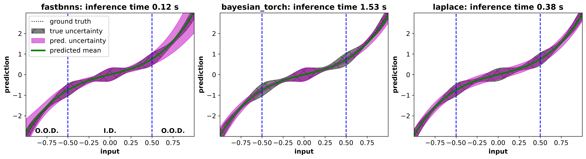

# FastBNNs: comparisons
Comparisons to other open-source software packages for Bayesian inference of neural networks are included in this directory.
Please review and install optional "comparisons" dependencies in [pyproject.toml](../pyproject.toml) to run comparisons.

## polynomial.py
[polynomial.py](polynomial.py) trains a Bayesian MLP with a custom, learnable nonlinearity to solve a 1D polynomial regression problem with heteroscedastic variance.
To compare different software packages for BNN training, we train the MLP using [bayesian-torch](https://github.com/IntelLabs/bayesian-torch) (which relies on Monte Carlo sampling to perform network inference) and [FastBNNs](https://github.com/lanl/FastBNNs).
Additionally, we train the base NN to minimize mean squared error between predictions and observations, and then use [Laplace](https://github.com/aleximmer/Laplace) to estimate the posterior distribution and perform network inference.

A nominal output figure generated by this script is included below for reference.
In this figure, [polynomial.py](polynomial.py) was run on an NVIDIA RTX 2000 Ada Generation Laptop GPU.
Inference times on this hardware and problem demonstrate that [FastBNNs](https://github.com/lanl/FastBNNs) is faster than both sampling-based inference algorithms (i.e., [bayesian-torch](https://github.com/IntelLabs/bayesian-torch) with 30 Monte Carlo samples) and the generalized linear model algorithm commonly used in [Laplace](https://github.com/aleximmer/Laplace).
Notably, [Laplace](https://github.com/aleximmer/Laplace) is unable to model heteroscadastic aleatoric variance as needed for this problem, while [bayesian-torch](https://github.com/IntelLabs/bayesian-torch) is unable to model the parameter distribution of the custom nonlinearity, leading to inaccurate uncertainty estimates even for in-distribution data.

