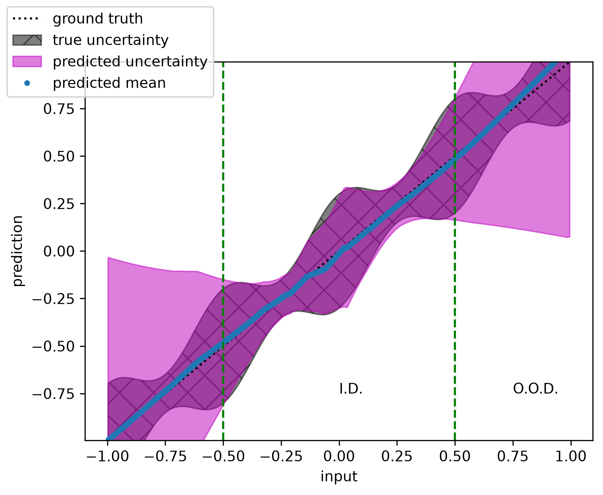
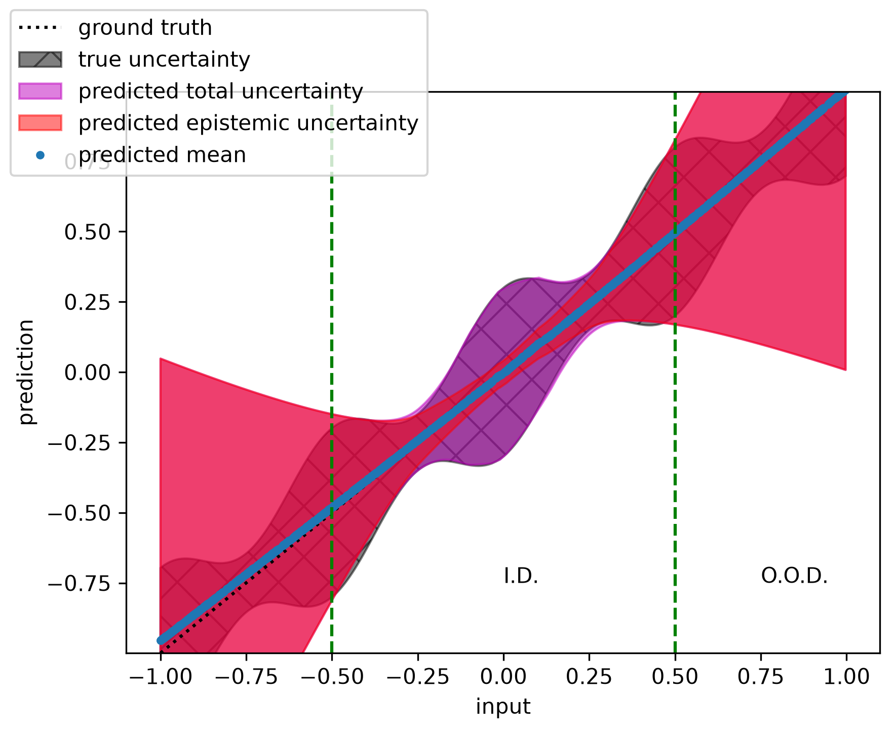
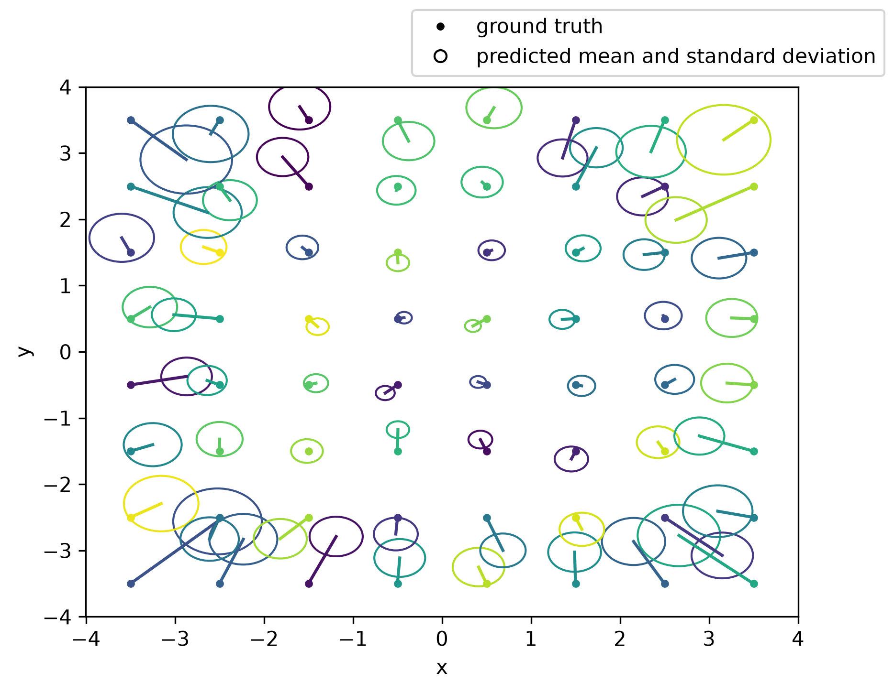

# FastBNNs: examples

Basic usage examples are provided in this directory to demonstrate usage of the FastBNNs package.
Descriptions and typical results are included for each example in the following sections.
Please review and install optional "examples" dependencies in [pyproject.toml](../pyproject.toml) to run these examples.

## mlp.py
[mlp.py](mlp.py) trains a Bayesian MLP to solve a 1D polynomial regression problem with heteroscedastic variance.
At inference, the MLP outputs a distribution defined by a mean and a variance, where the variance represents the *total* variance as a sum of epistemic and aleatoric variance.
This example generates and saves a representative set of predictions and their uncertainties for both in-distribution (I.D.) and out-of-distribution (O.O.D.) network inputs in an output PNG file.
Additionally, the "true uncertainty" is visualized as the square root of the sum of the simulated aleatoric variance and the mean squared error between predicted means and ground truth means.
A nominal output PNG is included below for reference.

## mlp_lightning.py
[mlp_lightning.py](mlp_lightning.py) reimplements [mlp.py](mlp.py) in [PyTorch Lightning](https://lightning.ai/docs/pytorch/stable/).

## mlp_uncertainty_demo.py
[mlp_uncertainty_demo.py](mlp_uncertainty_demo.py) uses an MLP to solve the same 1D polynomial regression with heteroscedastic variance problem from [mlp.py](mlp.py) and [mlp_lightning.py](mlp_lightning.py), however epistemic and aleatoric variance are modeled independently.
This is achieved by adding an output node to the MLP corresponding to the aleatoric variance as in Reference [1], allowing the parameter variance and its propagation through the MLP to the output node to be interpreted as epistemic variance.
This example generates and saves a representative set of predictions and their uncertainties in an output PNG file.
A nominal output PNG is included below for reference.

## cnn.py
[cnn.py](cnn.py) trains a Bayesian CNN to estimate the mean location of 2D Gaussian blobs in a square region of interest.
Notably, this CNN includes a custom nonlinearity before the output node to demonstrate FastBNNs implementation of the UTVI algorithm from Reference [2].
This example generates and saves a representative set of predictions and their uncertainties for test locations evenly spaced across the input region of interest (see Reference [2] for more details about this problem and expected results).
A nominal output PNG is included below for reference.

## References
[1] Nix, David A., and Andreas S. Weigen. Estimating the mean and variance of the target probability distribution. Proceedings of 1994 ieee international conference on neural networks (ICNN'94). Vol. 1. IEEE, 1994.
[2] David J. Schodt. Few-sample Variational Inference of Bayesian Neural Networks with Arbitrary Nonlinearities. 2024. arXiv:2405.02063 [cs].